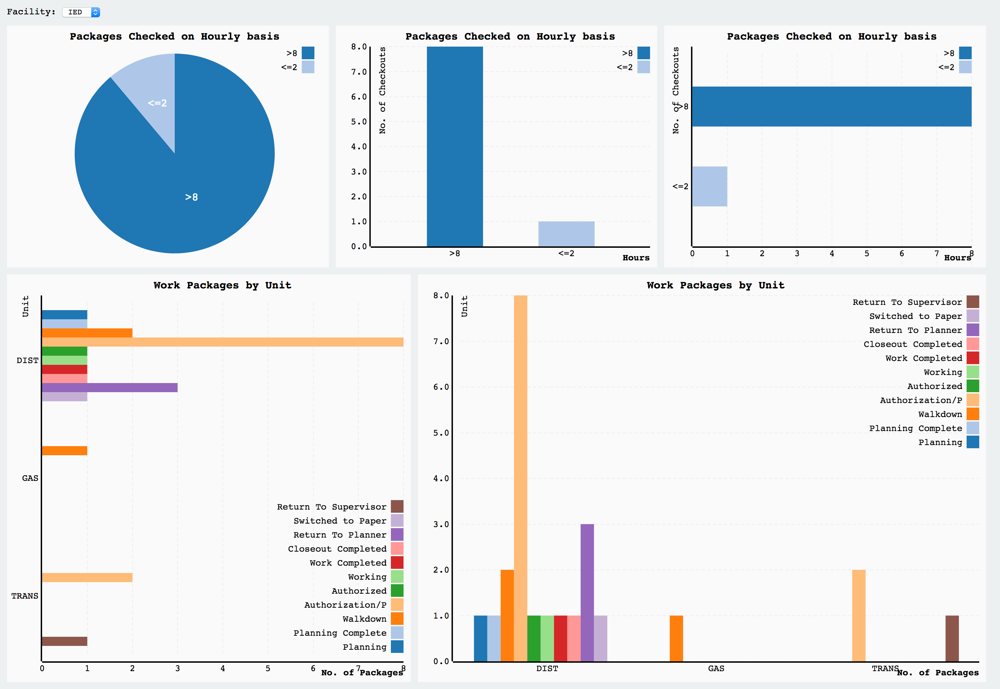

# D3 Dashboard

Customizable Dashboard and D3 Chart Components.



The grid-based dashboard layout implemeted by [Gridstack](http://gridstackjs.com/).

The chart drawing components are implemented in `www/js/dashboard.directives.js`, can be use as Angular directives.

For example, this code draw a groupped bar chart:

**HTML**
```html
<groupped-bar-chart source="w"></groupped-bar-chart>
```

**JavaScript**
```javascript
const w = {
  dataUrl: 'API URL to return data (as JSON format)',
  chartName: 'Chart Name',
  labels: {
    x: 'X Axis Label',
    y: 'Y Axis Label' 
  },
  fitData: function(data) {
    // Custom code logic to transform data if neccessary
  }
};
```
